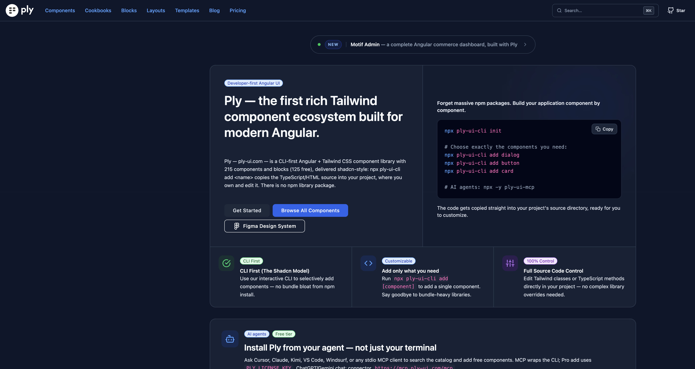

## About me


I'm **Lyudmil Dimitrov** (Lusso) — a front-end developer, UI/UX designer, and game illustrator from Bulgaria.

I started as a web designer and UI/UX designer. Front-end came later, out of a simple wish: to turn my own designs into web apps that still looked like the work I had drawn — not a hand-off, and not a compromise. That is still the job. Composition first, then the Angular that ships it. I paint, and I can draw animation. Color, silhouette, and timing get decided in the studio before they land in a component.

What I reach for


| Rank | In my hands                     |
| ---- | ------------------------------- |
| 1    | Angular & TypeScript            |
| 2    | Tailwind CSS                    |
| 3    | UI/UX, illustration, and motion |


## Ply

I built **[Ply](https://ply-ui.com)** — a CLI-first Angular + Tailwind component library. It is the shadcn model for Angular: `npx ply-ui-cli add` copies TypeScript and HTML into your repo. You own the source. There is no runtime UI package to fight.



215 components and blocks (125 free). A Figma design system that matches the code. SSR-safe catalog, enforced in CI. An MCP server so Cursor, Claude, and other agents can search and install from the catalog — not only from a terminal.

```bash
npx ply-ui-cli init
npx ply-ui-cli add dialog button card
# AI agents: npx -y ply-ui-mcp
```

What that product is, in practice:

- **Primitives you can edit** — buttons, dialogs, tables, calendars, forms. Change a Tailwind class, rewrite the template, delete the file.
- **Layouts and templates** — Motif (commerce), Motif Admin, Relay (team workspace). Full apps, not screenshots of apps.
- **A design system with two doors** — Figma for the visual language, CLI for the implementation. Same components, same ownership model.

Docs, demos, and source: [ply-ui.com](https://ply-ui.com) · [GitHub](https://github.com/ply-ui-ng/ply) · [live dashboard](https://demo.ply-ui.com/app/dashboard) · [Figma](https://www.figma.com/community/file/1662825988518656661)

## UI / UX

I treat UI as a drawing problem and UX as a sequencing problem.

- **Composition first.** Hierarchy, rhythm, and negative space before decoration. If the layout is wrong, no component library saves it.
- **Simple, clean interfaces.** Years of mobile and web product work taught me to cut until the screen reads in one look — then keep the craft in the type, spacing, and states.
- **Systems, not one-offs.** Tokens, density, radius, and type that hold up across a catalog — then across Motif, an admin, and a workspace.
- **Motion with weight.** Animation is drawing in time: easing, overlap, and when *not* to move. I illustrate the motion, then implement it.
- **The code is the design file.** Copy-in source beats a theme API you cannot see. If a designer (or an agent) cannot change the markup, the system is closed.
- **Accessible by default.** Keyboard paths, contrast, and names that survive a screen reader. Ply ships a WCAG-oriented accessibility report because procurement asks, and because it is the right bar.

I am strongest where product, visual design, and front-end meet: the moment a layout has to become a real route, with real states, and still look like the design it came from.

## Work

I have been in front-end for more than ten years. **Ply** is the peak of that work — the UI I built to show what I can do.

For more than six years I have been a front-end developer and UI/UX designer at [Decentralized Pictures](https://www.decentralized.pictures). I also spent more than two years as lead front-end at [bob.ai](https://bob.ai). Most of my contracts come through [Upwork](https://www.upwork.com/freelancers/~01652d16583b914931), where I work as **Lusso**: 5.0 from 65 reviews, 100% Job Success, and **Top Rated Plus**, a badge Upwork awards to the top 3% of talent on the platform.

For the last two years I have been building Ply as a side project. It is ready.

## Paint, games & animation

I still paint. I still draw animation. That studio habit is not a side note: it is how I see form. Color that is mixed, marks that have pressure, motion that has a beginning, a middle, and a stop. When I build a hover, a page transition, or an empty state, I am still drawing.

Selected earlier work

Game illustration and design — Hive Command, GorTiki Quest, Running Knight, Captain Pearl, Beat The Bully, Sheep Skate, PhsihoPets.

Mobile UI/UX — V-Control Pro, Do A Plan, iHealthReward, FocusMgmt, Car Reminder.

Web and desktop — StatPay.MD, RealtyFounder, Team Mowjow, Museum Trek, South Tyrol, Durametric, California Penalty Codes.

A new personal site is in progress. Until then, the public work to look at is Ply.


---

> I still start with a line. The component is just the line that shipped.
>
> — Lusso

